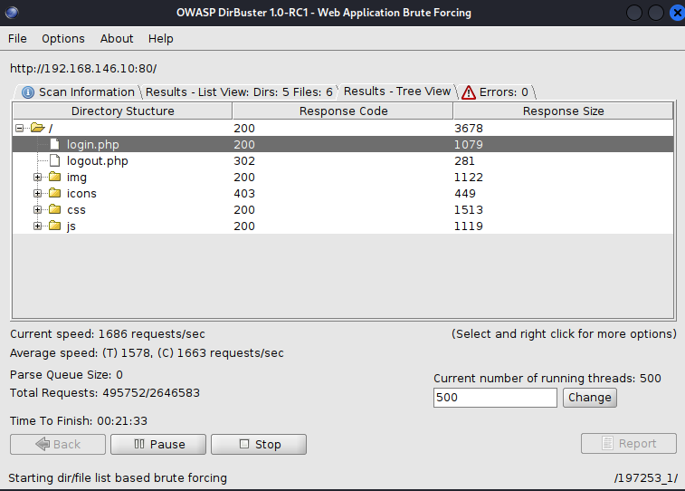
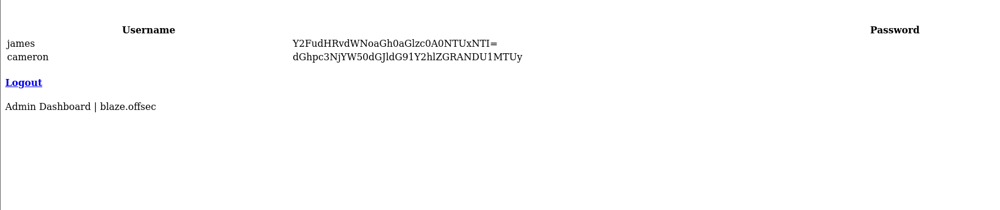
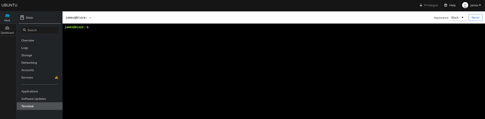
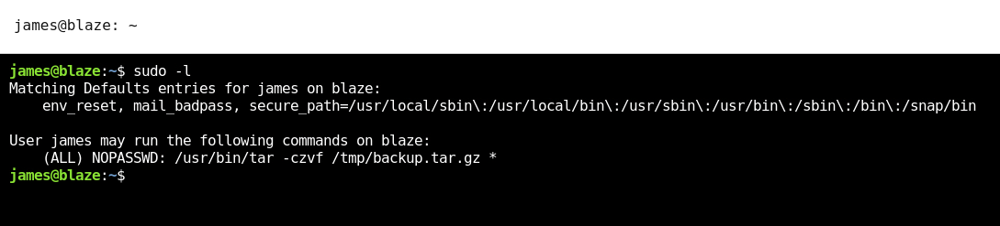
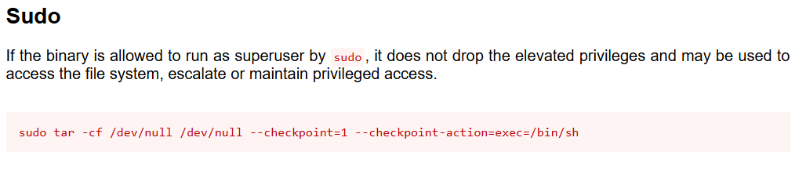
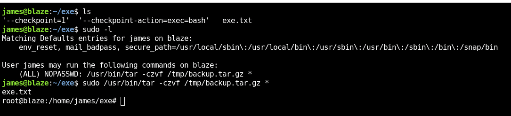

## 偵查
```shell
[~] The config file is expected to be at "/home/kali/.rustscan.toml"
[~] Automatically increasing ulimit value to 5000.
Open 192.168.146.10:22
Open 192.168.146.10:80
Open 192.168.146.10:9090
[~] Starting Script(s)
[>] Running script "nmap -vvv -p {{port}} -{{ipversion}} {{ip}} -sC -sV" on ip 192.168.146.10
Depending on the complexity of the script, results may take some time to appear.
[~] Starting Nmap 7.95 ( https://nmap.org ) at 2025-09-03 23:46 EDT
NSE: Loaded 157 scripts for scanning.
NSE: Script Pre-scanning.
NSE: Starting runlevel 1 (of 3) scan.
Initiating NSE at 23:46
Completed NSE at 23:46, 0.00s elapsed
NSE: Starting runlevel 2 (of 3) scan.
Initiating NSE at 23:46
Completed NSE at 23:46, 0.00s elapsed
NSE: Starting runlevel 3 (of 3) scan.
Initiating NSE at 23:46
Completed NSE at 23:46, 0.00s elapsed
Initiating Ping Scan at 23:46
Scanning 192.168.146.10 [4 ports]
Completed Ping Scan at 23:46, 0.10s elapsed (1 total hosts)
Initiating Parallel DNS resolution of 1 host. at 23:46
Completed Parallel DNS resolution of 1 host. at 23:46, 0.00s elapsed
DNS resolution of 1 IPs took 0.00s. Mode: Async [#: 1, OK: 0, NX: 1, DR: 0, SF: 0, TR: 1, CN: 0]
Initiating SYN Stealth Scan at 23:46
Scanning 192.168.146.10 [3 ports]
Discovered open port 22/tcp on 192.168.146.10
Discovered open port 80/tcp on 192.168.146.10
Discovered open port 9090/tcp on 192.168.146.10
Completed SYN Stealth Scan at 23:46, 0.10s elapsed (3 total ports)
Initiating Service scan at 23:46
Scanning 3 services on 192.168.146.10
Completed Service scan at 23:46, 6.18s elapsed (3 services on 1 host)
NSE: Script scanning 192.168.146.10.
NSE: Starting runlevel 1 (of 3) scan.
Initiating NSE at 23:46
Completed NSE at 23:46, 30.23s elapsed
NSE: Starting runlevel 2 (of 3) scan.
Initiating NSE at 23:46
Completed NSE at 23:46, 0.32s elapsed
NSE: Starting runlevel 3 (of 3) scan.
Initiating NSE at 23:46
Completed NSE at 23:46, 0.00s elapsed
Nmap scan report for 192.168.146.10
Host is up, received reset ttl 61 (0.076s latency).
Scanned at 2025-09-03 23:46:06 EDT for 37s

PORT     STATE SERVICE REASON         VERSION
22/tcp   open  ssh     syn-ack ttl 61 OpenSSH 8.2p1 Ubuntu 4ubuntu0.5 (Ubuntu Linux; protocol 2.0)
| ssh-hostkey: 
|   3072 98:4e:5d:e1:e6:97:29:6f:d9:e0:d4:82:a8:f6:4f:3f (RSA)
| ssh-rsa AAAAB3NzaC1yc2EAAAADAQABAAABgQCmPOfERLKCxx+ufQz7eRTNuEEkJ+GX/hKPNPpCWlTiTgegmjYoXQ7MA5ibTRoJ6vxpPEggzNszJKbBrSVAbRuT2sBg4o7ywiGUy7vsDBpObMrBMsdKuue3gpkaNF8DL2pB3v/XAxtavq1Mh4vz4yj99cc2pX1GhSjpQTWlsK8Rl9DmBKp7t0XxEWwq3juQ9JiN5yAttMrbTDjwMNxcipsYv0pMudDBE6g4gQyiZGwuUfBn+HirxnfRr7KkxmBaEpZgukXSJ7fXYgpQVgNP2cvd2sy/PYe0kL7lOfYwG/DSLWV917RPIdsPPQYr+rqrBL7XQA2Qll30Ms9iAX1m9S6pT/vkaw6JQCgDwFSwPXrknf627jCS7vQ8mh8UL07nPO7Hkko3fnHIcxyJggi/BoAAi3GseOl7vCZl28+waWlNdbR8gaiZhDR1rLvimcm3pg3nv9m+0qfVRIs9fxq97cOEFeXhaGHXvQL6LYGK14ZG+jVXtPavID6txymiBOUsj8M=
|   256 57:23:57:1f:fd:77:06:be:25:66:61:14:6d:ae:5e:98 (ECDSA)
| ecdsa-sha2-nistp256 AAAAE2VjZHNhLXNoYTItbmlzdHAyNTYAAAAIbmlzdHAyNTYAAABBBAweAzke7+zPt3Untb06RlI4MEp+vsEJICUG+0GgPMp+vxOdxEhcsVY0VGyuC+plTRlqNi0zNv1Y0Jj0BYRMSUw=
|   256 c7:9b:aa:d5:a6:33:35:91:34:1e:ef:cf:61:a8:30:1c (ED25519)
|_ssh-ed25519 AAAAC3NzaC1lZDI1NTE5AAAAIPJP5z2Scxa02tfhI1SClflg5QtVdhMImHwY7GugVtfY
80/tcp   open  http    syn-ack ttl 61 Apache httpd 2.4.41 ((Ubuntu))
|_http-title: blaze
|_http-server-header: Apache/2.4.41 (Ubuntu)
| http-methods: 
|_  Supported Methods: HEAD GET POST OPTIONS
9090/tcp open  http    syn-ack ttl 61 Cockpit web service 198 - 220
| http-methods: 
|_  Supported Methods: GET HEAD
|_http-title: Did not follow redirect to https://192.168.146.10:9090/
Service Info: OS: Linux; CPE: cpe:/o:linux:linux_kernel

NSE: Script Post-scanning.
NSE: Starting runlevel 1 (of 3) scan.
Initiating NSE at 23:46
Completed NSE at 23:46, 0.00s elapsed
NSE: Starting runlevel 2 (of 3) scan.
Initiating NSE at 23:46
Completed NSE at 23:46, 0.00s elapsed
NSE: Starting runlevel 3 (of 3) scan.
Initiating NSE at 23:46
Completed NSE at 23:46, 0.00s elapsed
Read data files from: /usr/share/nmap
Service detection performed. Please report any incorrect results at https://nmap.org/submit/ .
Nmap done: 1 IP address (1 host up) scanned in 37.28 seconds
           Raw packets sent: 7 (284B) | Rcvd: 4 (172B)
```

## 列舉

- 80 port  
      
    目錄爆破到了 login.php ，可以輸入看看  
    
    可以嘗試看看有沒有 SQLi
    ```
    'or 1=1 -- ' / 123
    ```
    之後登入就是這個畫面
      
    base64 decode
    ```
    james / canttouchhhthiss@455152
    cameron / thisscanttbetouchedd@455152
    ```
    將上面的 credential 輸入到 9090 port 看看，發現可以登入，也可以使用 shell  
    

## 提權

先看看 sudo -l 

知道了可以使用 tar 來提權，可以看看 [GTFOBin](https://gtfobins.github.io/gtfobins/tar/)  

我們目前還缺兩個參數 checkpoint 跟 checkpoint-action，可以直接把這兩個參數變成檔名讓他們給 tar 吃進去  
然後還需要一個普通檔案，這樣才可以成功執行  
就像以下的截圖


