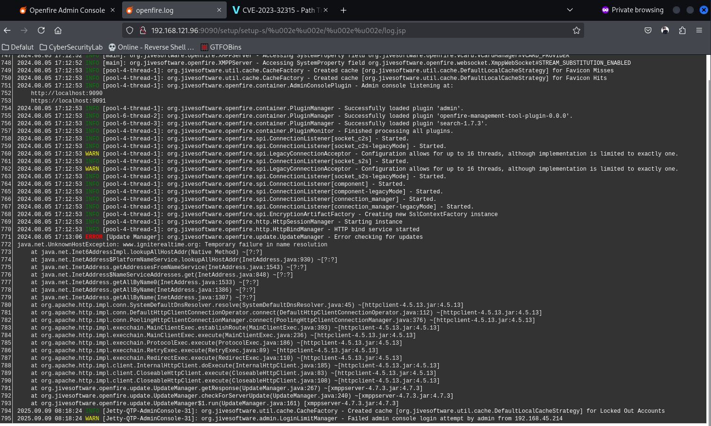

## 偵查

```shell
──(kali㉿kali)-[~/PG/Fired]
└─$ cat scan_result.txt 
# Nmap 7.95 scan initiated Tue Sep  9 04:16:05 2025 as: /usr/lib/nmap/nmap --privileged -vvv -p 22,9090,9091 -4 -sC -sV -o scan_result.txt 192.168.121.96
Nmap scan report for 192.168.121.96
Host is up, received echo-reply ttl 61 (0.069s latency).
Scanned at 2025-09-09 04:16:05 EDT for 32s

PORT     STATE SERVICE                REASON         VERSION
22/tcp   open  ssh                    syn-ack ttl 61 OpenSSH 8.2p1 Ubuntu 4ubuntu0.11 (Ubuntu Linux; protocol 2.0)
| ssh-hostkey: 
|   3072 51:56:a7:34:16:8e:3d:47:17:c8:96:d5:e6:94:46:46 (RSA)
| ssh-rsa AAAAB3NzaC1yc2EAAAADAQABAAABgQDEXg8FXWFLif7j7FQTu8UHDljVPydJScrSANssTmxaJiGrN+gwRDyUv2b+RDyMJQIh78HqKdGNtN2DyFkj7Mt78Rgb8+cHhCM4+qQAIj79w3BaA/U4776LXcoCGzJbZsaevQdLTCaVALgs7udySPJvQ+1s6dFHuNPuxmIRmRP9gf0K3rRbV04il4uUVkOD27qyPmzdSDH/BF+L/ySHkrZqHR4jU6oss2bUtJxT2XU/MS/uxxIoJW8Mx772nL/raLMhxpa3DRKbOCW32F/Jwn3St70NIuA1NX54djYYUJX7DyNFEJEcG7dv9IaPVPtqn+06VlxqfWkuMG9++OfbxPSJcLyPQev/KqLmXGfcMtcbx5q3dt4OphXFQX2XgRpaFlUva3VWLPiuXWK1inHCCRuS4XstquGaw4fFpAhwkSRlsU/Pp+21hqcsZP0IksRddCsqThMQ7G6UwnopYPAmX9HxZhFIq3OuF2Vrsmd2RqOP6kbHBQCl6e5RSiOMAGwrS/s=
|   256 fe:76:e3:4c:2b:f6:f5:21:a2:4d:9f:59:52:39:b9:16 (ECDSA)
| ecdsa-sha2-nistp256 AAAAE2VjZHNhLXNoYTItbmlzdHAyNTYAAAAIbmlzdHAyNTYAAABBBKul0mG57ikFKG/R4NkI3WOrqKfelhaucgrNRakIlWBS5kOhuds8Atr7ln/+Ibx68OAC4OmNCCIVfgCOTTeUNqY=
|   256 2c:dd:62:7d:d6:1c:f4:fd:a1:e4:c8:aa:11:ae:d6:1f (ED25519)
|_ssh-ed25519 AAAAC3NzaC1lZDI1NTE5AAAAIE8eByMdnF3xIjUD57sRJV68xTPIIajqwIJvps6f6Hu9
9090/tcp open  hadoop-tasktracker     syn-ack ttl 61 Apache Hadoop
| hadoop-tasktracker-info: 
|_  Logs: jive-ibtn jive-btn-gradient
| http-methods: 
|_  Supported Methods: GET HEAD POST OPTIONS
| hadoop-datanode-info: 
|_  Logs: jive-ibtn jive-btn-gradient
|_http-title: Site doesn't have a title (text/html).
|_http-favicon: Unknown favicon MD5: E4888EE8491B4EB75501996E41AF6460
9091/tcp open  ssl/hadoop-tasktracker syn-ack ttl 61 Apache Hadoop
|_ssl-date: TLS randomness does not represent time
|_http-title: Site doesn't have a title (text/html).
|_http-favicon: Unknown favicon MD5: E4888EE8491B4EB75501996E41AF6460
| ssl-cert: Subject: commonName=localhost
| Subject Alternative Name: DNS:localhost, DNS:*.localhost
| Issuer: commonName=localhost
| Public Key type: rsa
| Public Key bits: 2048
| Signature Algorithm: sha256WithRSAEncryption
| Not valid before: 2024-06-28T07:02:39
| Not valid after:  2029-06-27T07:02:39
| MD5:   41ee:f1c1:0cef:c4b0:2436:f5e7:75f4:b064
| SHA-1: c90c:b82e:0547:56be:1f7b:adb4:4a3a:5de7:c177:a4d3
| -----BEGIN CERTIFICATE-----
| MIIDDzCCAfegAwIBAgIIbgECN6DaQ+wwDQYJKoZIhvcNAQELBQAwFDESMBAGA1UE
| AwwJbG9jYWxob3N0MB4XDTI0MDYyODA3MDIzOVoXDTI5MDYyNzA3MDIzOVowFDES
| MBAGA1UEAwwJbG9jYWxob3N0MIIBIjANBgkqhkiG9w0BAQEFAAOCAQ8AMIIBCgKC
| AQEA0kAENEQochDNPuEOjx6OVtw065xn/4VFEJnvIkNltcmy71HGxn8sEjmhlUlI
| uQ5oMm+CAf0yk+jZI00eoM/Hdv2BcSKFE0cn20vc1Ht6crRAg1QOYE1qHFf8WADj
| k8P9PAPzyHd6nkwg3dl1LFjqQ8+tUxNGH3QADJDwZvln+iCD1LFLpBdKEpphnLYm
| sN5SW1UandvlwvQKAaHk0k804m1/clJiCD7RLwENqTOmpS4ZBo+j2rNye1ZkWDrv
| akPsW0dXoJwJOF6XmvFY+etbGjL0r+KZLeNXwtmmHPKgnXiRgK6tJHDrOs9YFed6
| LSWuBUVMRDiCofzDry1RAfF2EwIDAQABo2UwYzAhBgNVHREEGjAYgglsb2NhbGhv
| c3SCCyoubG9jYWxob3N0MB0GA1UdDgQWBBTCfjZX0g2ZzFubIKxpJUUtDkCmRDAf
| BgNVHSMEGDAWgBTCfjZX0g2ZzFubIKxpJUUtDkCmRDANBgkqhkiG9w0BAQsFAAOC
| AQEAF+a26AV7ATql2PmevKuMO6HvAw75WsdIHYem0vCDUewiq2Ru9kaUc+yOSzCP
| jZOc3zFvHAyVBKal5w+EPDTU3CxiKkZJtN0sLNCwQy5TDSfllyZxYdiEP3siHTRy
| T2KB2GsNfopJfZliPqKf+xCyvuTPH7/jj46BKehFLhBDJ8cgcgIIKUt2UYp95Ipp
| IeMzBeH1OT4QCXbMz4J4Y2YbIULhG46Cm2dyHfnrILYTJz1EdQq+MfFx6aNE8/GF
| Lz9UdhWZ9Ne4bS/hMqTOu0vcLe7/HL3jupwv5wSK4ZQaUe9YMbi9HA5+Ycyr39GK
| ZtbikUcLXOiuewBkRoOhLi2GxA==
|_-----END CERTIFICATE-----
| http-methods: 
|_  Supported Methods: GET HEAD POST OPTIONS
| hadoop-datanode-info: 
|_  Logs: jive-ibtn jive-btn-gradient
| hadoop-tasktracker-info: 
|_  Logs: jive-ibtn jive-btn-gradient
Service Info: OS: Linux; CPE: cpe:/o:linux:linux_kernel

Read data files from: /usr/share/nmap
Service detection performed. Please report any incorrect results at https://nmap.org/submit/ .
# Nmap done at Tue Sep  9 04:16:37 2025 -- 1 IP address (1 host up) scanned in 31.72 seconds
```

## 列舉

- 9090
  - openfire admin console (*)
- 9091
  - 亂碼字串

那就找找版本號找破解的方法 `Openfire, Version: 4.7.3 vuln`  
結果找到了這篇文章，[利用 Path Traversal 的漏洞來 Bypass 登入](https://www.vicarius.io/vsociety/posts/cve-2023-32315-path-traversal-in-openfire-leads-to-rce)
來試試看他的 payload , `http://<target>/setup/setup-s/%u002e%u002e/%u002e%u002e/log.jsp`

結果成功看到 log 檔案，證明有此漏洞
之後看到了 GitHub 上的 [exploit](https://github.com/miko550/CVE-2023-32315)，這樣就可以成功進入後台並執行 command 

## 提權

用 LinPeas 掃出來看起來沒有東西可以利用  
有嘗試使用 PwnKit，但無效  
有看到 ssh 允許 root 登入，說明應該是要有 root 的 ssh password
於是翻翻看有沒有相關的檔案，最後在 /var/lib/openfire/embedding-db 找到了 smtp 的 password，有標註 user 是 root  
所以就嘗試用 root 登入 ssh，結果成功登入