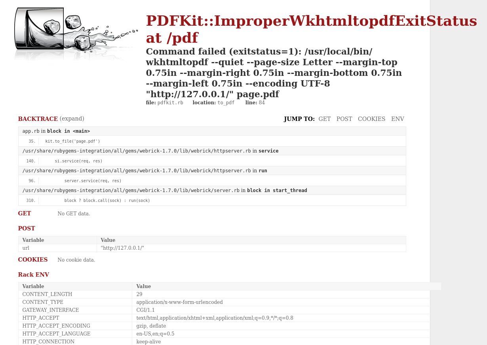

## 偵查

```shell
# Nmap 7.95 scan initiated Wed Sep 10 00:44:07 2025 as: /usr/lib/nmap/nmap --privileged -vvv -p 22,3000 -4 -sC -sV -o scan_result.txt 192.168.235.22
Nmap scan report for 192.168.235.22
Host is up, received reset ttl 61 (0.20s latency).
Scanned at 2025-09-10 00:44:08 EDT for 13s

PORT     STATE SERVICE REASON         VERSION
22/tcp   open  ssh     syn-ack ttl 61 OpenSSH 8.9p1 Ubuntu 3ubuntu0.1 (Ubuntu Linux; protocol 2.0)
| ssh-hostkey: 
|   256 b9:bc:8f:01:3f:85:5d:f9:5c:d9:fb:b6:15:a0:1e:74 (ECDSA)
| ecdsa-sha2-nistp256 AAAAE2VjZHNhLXNoYTItbmlzdHAyNTYAAAAIbmlzdHAyNTYAAABBBBYESg2KmNLhFh1KJaN2UFCVAEv6MWr58pqp2fIpCSBEK2wDJ5ap2XVBVGLk9Po4eKBbqTo96yttfVUvXWXoN3M=
|   256 53:d9:7f:3d:22:8a:fd:57:98:fe:6b:1a:4c:ac:79:67 (ED25519)
|_ssh-ed25519 AAAAC3NzaC1lZDI1NTE5AAAAIBdIs4PWZ8yY2OQ6Jlk84Ihd5+15Nb3l0qvpf1ls3wfa
3000/tcp open  http    syn-ack ttl 61 WEBrick httpd 1.7.0 (Ruby 3.0.2 (2021-07-07))
| http-methods: 
|_  Supported Methods: GET HEAD
|_http-title: RubyDome HTML to PDF
|_http-server-header: WEBrick/1.7.0 (Ruby/3.0.2/2021-07-07)
Service Info: OS: Linux; CPE: cpe:/o:linux:linux_kernel

Read data files from: /usr/share/nmap
Service detection performed. Please report any incorrect results at https://nmap.org/submit/ .
# Nmap done at Wed Sep 10 00:44:21 2025 -- 1 IP address (1 host up) scanned in 13.76 seconds
```

## 列舉

先看看 3000 port 上運行的 service ，發現是一個 RubyDome HTML to PDF service  
可以輸入 URL 來轉換成 PDF，可以試試看 `localhost`  
結果跳出來以下的頁面：  
  
是一個 `PDFKit` ，他好像是一個目標，可以嘗試看看找找 exploit  
找到了一個 CVE-2022–25765 的 [exploit](https://github.com/UNICORDev/exploit-CVE-2022-25765)  
然後運行過後就可以拿到 Rev Shell

## 提權

執行 `sudo -l`，發現可以執行 `usr/bin/ruby /home/andrew/app/app.rb`，所以只要把 app.rb 改成 `exec /bin/bash` 就可以拿到 root shell