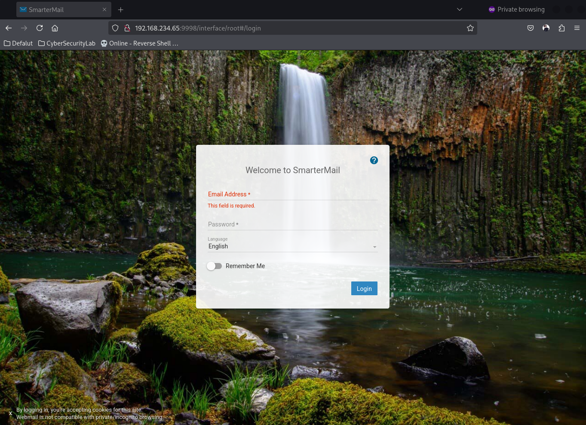

## 偵查
- Rustscan
  ```
  Open 192.168.234.65:21
  Open 192.168.234.65:80
  Open 192.168.234.65:135
  Open 192.168.234.65:139
  Open 192.168.234.65:445
  Open 192.168.234.65:5040
  Open 192.168.234.65:9998
  Open 192.168.234.65:17001
  Open 192.168.234.65:49665
  Open 192.168.234.65:49667
  Open 192.168.234.65:49666
  Open 192.168.234.65:49668
  Open 192.168.234.65:49664
  Open 192.168.234.65:49669
  ```
- Nmap
    ```shell
    PORT      STATE SERVICE       REASON          VERSION
    21/tcp    open  ftp           syn-ack ttl 125 Microsoft ftpd
    | ftp-syst: 
    |_  SYST: Windows_NT
    | ftp-anon: Anonymous FTP login allowed (FTP code 230)
    | 04-29-20  10:31PM       <DIR>          ImapRetrieval
    | 08-28-25  05:59AM       <DIR>          Logs
    | 04-29-20  10:31PM       <DIR>          PopRetrieval
    |_04-29-20  10:32PM       <DIR>          Spool
    80/tcp    open  http          syn-ack ttl 125 Microsoft IIS httpd 10.0
    |_http-server-header: Microsoft-IIS/10.0
    |_http-title: IIS Windows
    | http-methods: 
    |   Supported Methods: OPTIONS TRACE GET HEAD POST
    |_  Potentially risky methods: TRACE
    135/tcp   open  msrpc         syn-ack ttl 125 Microsoft Windows RPC
    139/tcp   open  netbios-ssn   syn-ack ttl 125 Microsoft Windows netbios-ssn
    445/tcp   open  microsoft-ds? syn-ack ttl 125
    5040/tcp  open  unknown       syn-ack ttl 125
    9998/tcp  open  http          syn-ack ttl 125 Microsoft HTTPAPI httpd 2.0 (SSDP/UPnP)
    |_http-favicon: Unknown favicon MD5: 9D7294CAAB5C2DF4CD916F53653714D5
    | http-methods: 
    |_  Supported Methods: GET HEAD POST OPTIONS
    | http-title: Site doesn't have a title (text/html; charset=utf-8).
    |_Requested resource was /interface/root
    | uptime-agent-info: HTTP/1.1 400 Bad Request\x0D
    | Content-Type: text/html; charset=us-ascii\x0D
    | Server: Microsoft-HTTPAPI/2.0\x0D
    | Date: Thu, 28 Aug 2025 15:49:06 GMT\x0D
    | Connection: close\x0D
    | Content-Length: 326\x0D
    | \x0D
    | <!DOCTYPE HTML PUBLIC "-//W3C//DTD HTML 4.01//EN""http://www.w3.org/TR/html4/strict.dtd">\x0D
    | <HTML><HEAD><TITLE>Bad Request</TITLE>\x0D
    | <META HTTP-EQUIV="Content-Type" Content="text/html; charset=us-ascii"></HEAD>\x0D
    | <BODY><h2>Bad Request - Invalid Verb</h2>\x0D
    | <hr><p>HTTP Error 400. The request verb is invalid.</p>\x0D
    |_</BODY></HTML>\x0D
    |_http-server-header: Microsoft-IIS/10.0
    17001/tcp open  remoting      syn-ack ttl 125 MS .NET Remoting services
    49664/tcp open  msrpc         syn-ack ttl 125 Microsoft Windows RPC
    49665/tcp open  msrpc         syn-ack ttl 125 Microsoft Windows RPC
    49666/tcp open  msrpc         syn-ack ttl 125 Microsoft Windows RPC
    49667/tcp open  msrpc         syn-ack ttl 125 Microsoft Windows RPC
    49668/tcp open  msrpc         syn-ack ttl 125 Microsoft Windows RPC
    49669/tcp open  msrpc         syn-ack ttl 125 Microsoft Windows RPC
    Service Info: OS: Windows; CPE: cpe:/o:microsoft:windows

    Host script results:
    | smb2-security-mode: 
    |   3:1:1: 
    |_    Message signing enabled but not required
    |_clock-skew: -1s
    | smb2-time: 
    |   date: 2025-08-28T15:49:09
    |_  start_date: N/A
    | p2p-conficker: 
    |   Checking for Conficker.C or higher...
    |   Check 1 (port 24537/tcp): CLEAN (Couldn't connect)
    |   Check 2 (port 25579/tcp): CLEAN (Couldn't connect)
    |   Check 3 (port 16925/udp): CLEAN (Timeout)
    |   Check 4 (port 46039/udp): CLEAN (Failed to receive data)
    |_  0/4 checks are positive: Host is CLEAN or ports are blocked
    ```

## 分析

先看看是什麼 CMS

感覺可以找到 exploit RCE  
[exploit](https://www.exploit-db.com/exploits/49216)  
這個是依賴 17001 port 的 .NET Remoting to get RCE 的 exploit
應該是這個沒錯
```python
python 49216.py
```
```
PS C:\Windows\system32> 
```
Get system privileges!